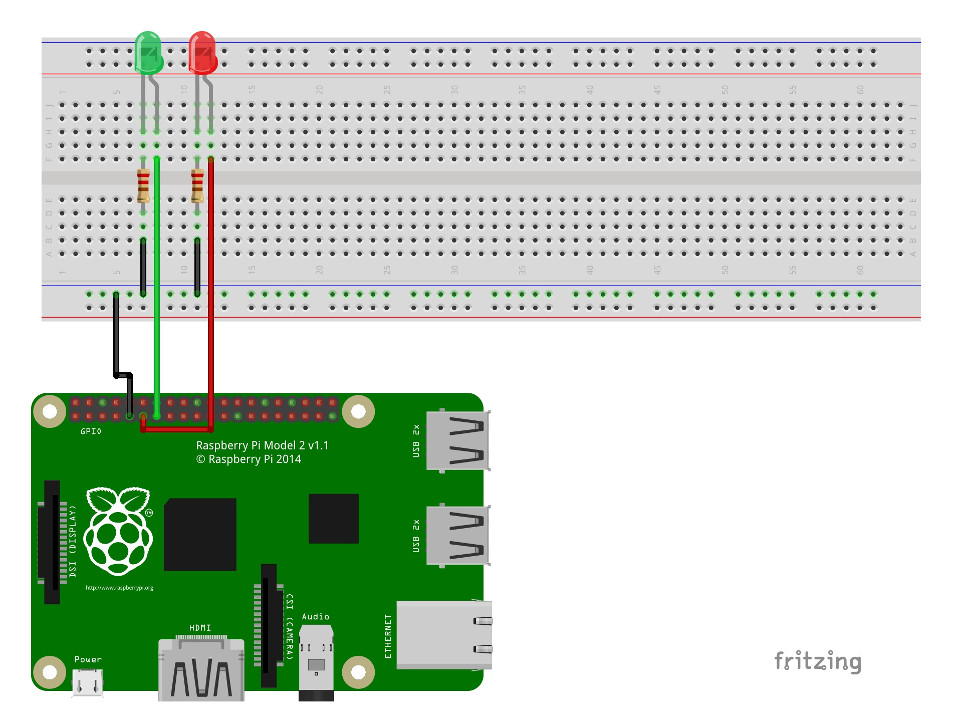

# **Unlock The Door**

### **HOW TO install the RaspberryPi**

**What you need:**

*   RaspberryPi
*   BreadBoard
*   2 leds with differents colors
*   Jumper Wires male/female for the GPIO
*   Jumper Wires male/male for the breadboard
*   Mouse
*   Keyboard
*   Monitor
*   Wifi Dongle or Ethernet cable
*   MicroSD card (at least 4go)

Note: If you dont have any other mouse/monitor/keyboard you can log into the RPi through SSH (login: pi, password: raspberry)

Download Raspbian (https://www.raspberrypi.org/downloads/raspbian/)  
Install the image on the SDcard  
Put the SDcard in te Raspberry Pi and connect it to a screen with a keyboard/mouse/wifi(or ethernet cable)  
Open the keyboard layout and be sure its in your usual layout.  
Change the Raspberry name for something more explicit.  
Verify the ip adress (top-right corner or use ifconfig in the Terminal)

**Open the Terminal and type:**

1.  sudo apt-get install apache2 -y
2.  sudo apt-get update
3.  sudo apt-get install php5 libapache2-mod-php5 -y
4.  sudo apt-get upgrade

**Then type:**

1.  cd /
2.  cd var/wwww/html
3.  sudo rm index.html
4.  sudo nano index.php

**Copy and paste this code inside the index.php:**

    <?php 
    exec("gpio mode 0 out");
    exec("gpio mode 2 out");
    exec("gpio mode 3 out");
    if (isset($_GET['led1'])) {	
    	if($_GET['led1'] == 1) {
	    	exec("gpio write 0 1");// pin 0 in wiring pi is gpio 17
	    } else {
	    	exec("gpio write 0 0");
	    }
    }
    if(isset($_GET['led2'])) {
	    if($_GET['led2'] == 1) {
		    exec("gpio write 2 1");// pin 2 in wiring pi is gpio 27
	    } else {
		    exec("gpio write 2 0");
	    }
    }
    ?>

**Now:**

1.  cd /
2.  cd etc/apache2
3.  sudo nano ports.conf

Look for "Listen 80" and add under "Listen xxxx" where "xxxx" is the port you want for the Raspberry.  
Use the same syntax.

*   CTRL+X then Y then Enter to save
*   cd sites-available/
*   sudo nano 000-default.conf
*   Look for do the same for the port you choose
*   CTRL+X then Y then Enter to save
*   sudo service apache2 reload netstat -ctpl  
> Verify if the port chosen is in **"Listen"**

Now open your router page and go into the PortForward options (NAT) redirect the port chosen to the RaspberryPi local ip

**Here the circuit diagram:**

Now you can try the leds using a url type: 192.168.*.*/?led1=1  
Where * is your local RaspberryPi adress.

Enjoy.
